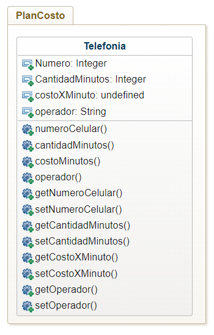

# ENCAPSULACION

- CUando un objeto se encuentra encapsulado, solo sus metodos tienen acceso a sus atributos, evitando asi, la manipulacion de los atributos, mediante la presencia de fuentes externos, es decir, quien programa un objeto controla los metodos de acceso, su estado y comportamiento.
- La encapsulacion es una de las propiedades mas importantes de la POO
- Consiste basicamente en proteger los atributos del acceso directos de los objetos colocandolos en una zona privada, y la unica forma de acceseder a ellos es por medio de los metodos que estan en una zona publica
- Consite en la separacion de las propiedades externas de un objeto, correspondiente a la intefaz de sus funciones de los detalles de impletacion del objetos. En pocas palabras, se parar la interfaz de los objetos.
- Se reduce la complejidad del sistemas protegiendo los objetos contra posibles errores, y permitiendo dejar de mejor manera extensiones futuras en la implementacion de los objetos. 

## MENSAJES
- Una aplicacion orientada a objetos esta compuesta por varios objetos creados desde sus respectivas clases.
- Estos objetos necesitan una forma de comunicarse para intercambiar datos entre si, y lo hacen por meido de mensajes
- Los mensjaes pueden contener parametros, en los cuales se indican las caracteristicas especificas de la accion a realizar
- Estructuralmente esta compuesto por los siguientes elementos
    1. Objeto destino, hacia el cual el mensaje es enviado
    2. El nombre del metodo a llamar
    3. Parametros solicitados por el metodo, atraves del cual suele darse la informacion.
- El envio y recepcion de mensajes es simplemente una peticion de un objeto a otro para este se comporte de una manera determinada, ejerciendo uno de sus metodos 
Ejemplo:
   Si existe un objeto A de la clase carro y un objeto B de la clase impuesto, para calcular el 10% de impuestos sobre el precio del carro, la comunicacion podria ser:

   `float costo = A.getPrecio();`

  `B.calcularImpuesto(costo*0.10);`
## ciclo de vida de los objetos
- el objeto nace cuando se crea, vive cuando se utiliza e un programa y cuando deja usarse.
## CONSTRUCTORES
- Son metodos especiales, que tienen las siguientes caracteristicas:
    - se llaman solo una vez al crear el objeto
    - tienen el mismo nombre de la clase
    - pueden haber varios sobrecarga de metodos
    al crear un objeto solo se utiliza uno
    - no devuelve nada, ni void
- inicializa los atributos del objeto al momento de crearse sin hacer otra instruccion adicional
- java provee un constructor por defecto
-Tipos:
    - por defecto: no recibe parametros
    - comun u ordinario: puede recibir toda clase de parametros
    - copia: permite la construccion de una copia del objeto

## Crecimiento y vida del objeto
 - Una vez creado el objeto:
    . se pude trabajar con el
    - llamar a los metodos de su clase
    - guardar datos para almacenarlos temporalmente antes e registrarlos en una base de datos
    - compartir datos con los demas objetos pasandoles mensajes
- cada objeto consume memoria, y depende de atributos que tenga

## muerto del obejto
- java utiliza el garbage collector para liberar los objetos no referenciados
-java cuenta las referencias que hay sobre cada objeto. el objeto se borra cuando no tenga referencias
- antes de borrarlo Java da la oportunidad de limpiarse a si mismo: finalizacion. 
- llamado exlpicito al gc System.gc();

## Ejercicio
generar un programa para gestionar un plan de telefonia celular, el plan tiene un numeor de celular, un operador, cantidad de minutos y costo por minuto, calcular el total a pagar teniendo en cuenta que si e operador Movilujo tiene un 50% de descuento. USar minimo 3 constructores

## GRAFICA
